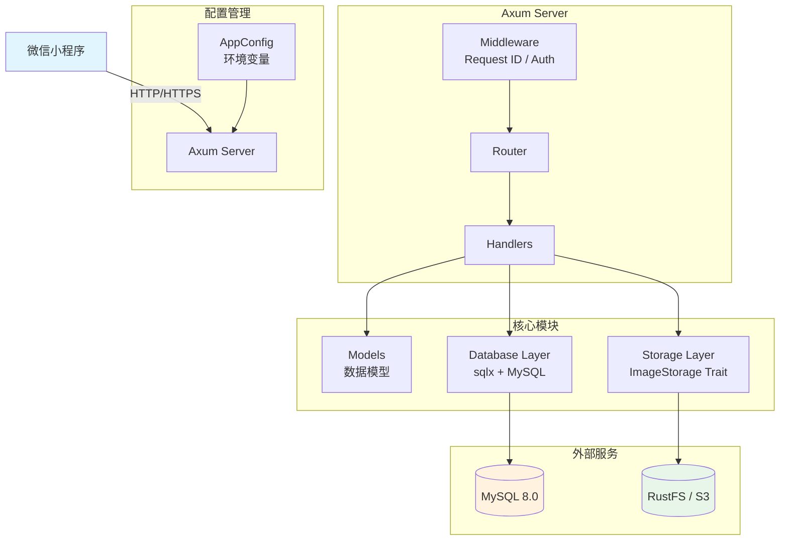
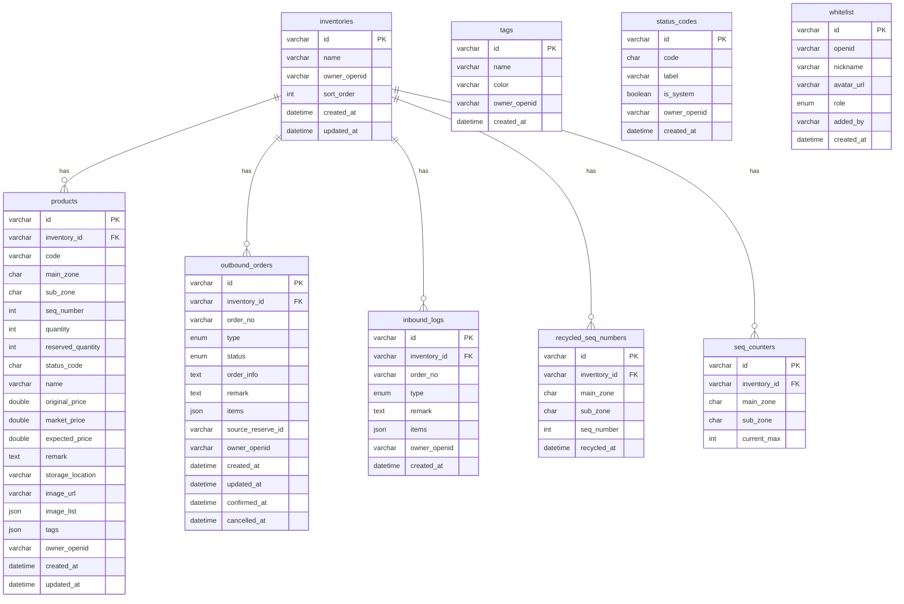
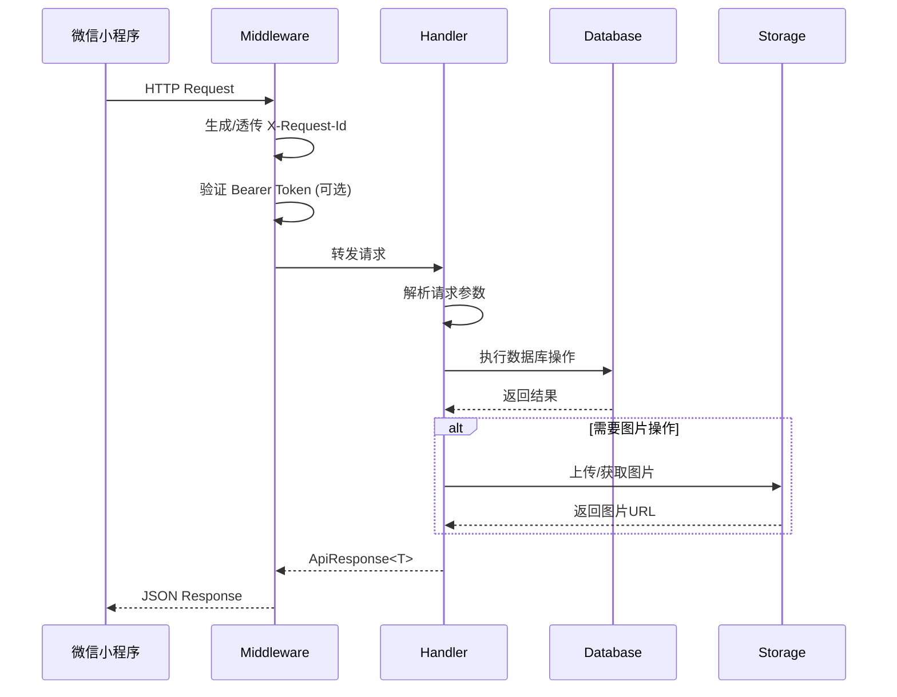

# Goodser Backend (Rust)

Goodser 库存管理系统的 Rust 后端服务，为微信小程序提供 REST API。

## 技术栈

- **Web 框架**: Axum 0.7
- **数据库**: MySQL 8.0 (sqlx)
- **对象存储**: RustFS (S3-compatible)
- **运行环境**: Docker

## 系统架构图



## 数据库 ER 图



## 请求处理流程



## 项目结构

```
backend/
├── Cargo.toml          # 依赖配置
├── Dockerfile          # 多阶段构建
├── sql/init.sql        # 数据库初始化脚本
├── src/
│   ├── main.rs         # 入口：路由注册、Server 启动
│   ├── config.rs       # 环境配置加载
│   ├── error.rs        # 错误定义与 HTTP 响应转换
│   ├── models/         # 数据模型 struct/enum，序列化
│   │   ├── inventory.rs
│   │   ├── product.rs
│   │   ├── order.rs    # OrderType/OrderStatus 枚举
│   │   ├── tag.rs
│   │   ├── status_code.rs
│   │   ├── whitelist.rs
│   │   └── inbound_log.rs
│   ├── db/             # MySQL 数据访问层
│   │   └── mysql.rs    # Repository 模式，sqlx 异步查询
│   ├── handlers/       # API handler 函数
│   │   ├── inventory.rs
│   │   ├── product.rs
│   │   ├── order.rs
│   │   ├── inbound.rs
│   │   ├── tag.rs
│   │   ├── status_code.rs
│   │   ├── whitelist.rs
│   │   └── image.rs
│   ├── middleware/      # Bearer Token 认证
│   │   └── mod.rs
│   └── storage/         # RustFS (S3) 图片存储
│       ├── mod.rs       # ImageStorage trait
│       └── rustfs.rs    # aws-sdk-s3 实现
└── tests/
    └── integration_test.rs
```

## 核心特性

| 特性 | 体现位置 |
|------|---------|
| **所有权/借用** | 函数签名全部使用引用 (`&str`, `&Request`)，避免不必要 clone |
| **struct/enum** | `OrderType`, `OrderStatus`, `InboundType` 等枚举 + 9 个业务 struct |
| **trait** | `ImageStorage` trait 抽象对象存储；`Repository` 模式抽象数据库 |
| **泛型** | `ApiResponse<T>` 统一响应包装器 |
| **生命周期** | `&'static str` 在 middleware 中标注 API key 生命周期 |
| **错误处理** | 自定义 `AppError` (thiserror)，`?` 操作符传播，自动转换 HTTP 状态码 |
| **async/await** | tokio + Axum 全异步，sqlx 异步数据库 |
| **模块化** | 7 个模块 (models/db/handlers/middleware/storage/config/error) |

## API 接口

所有请求格式: `POST /api/{action}`

**请求**:
```json
{ "field1": "value1", ... }
```

**成功响应**:
```json
{ "code": 0, "data": { ... } }
```

**错误响应**:
```json
{ "code": 40001, "message": "错误描述" }
```

### 接口列表

| action | 说明 | 认证 |
|--------|------|------|
| `loadInventories` | 获取库存目录列表 | 否 |
| `loadProducts` | 获取商品列表 | 否 |
| `loadOutboundOrders` | 获取出库单列表 | 否 |
| `loadInboundLogs` | 获取入库日志列表 | 否 |
| `loadTags` | 获取标签列表 | 否 |
| `loadStatusCodes` | 获取状态编码列表 | 否 |
| `loadWhitelist` | 获取白名单列表 | 否 |
| `createInventory` | 创建库存目录 | 是 |
| `updateInventory` | 更新库存目录 | 是 |
| `deleteInventory` | 删除库存目录 | 是 |
| `createProduct` | 创建商品 | 是 |
| `updateProduct` | 更新商品 | 是 |
| `deleteProduct` | 删除商品 | 是 |
| `allocateSeq` | 分配序号 | 是 |
| `inboundSingle` | 单独入库 | 是 |
| `inboundBatch` | 批量入库 | 是 |
| `inboundSearchImport` | 搜索导入入库 | 是 |
| `createOutbound` | 创建出库单 | 是 |
| `confirmOutbound` | 确认出库 | 是 |
| `cancelOutbound` | 取消出库 | 是 |
| `cancelReserve` | 取消预留 | 是 |
| `reserveToOutbound` | 预留转出库 | 是 |
| `createTag` | 创建标签 | 是 |
| `updateTag` | 更新标签 | 是 |
| `deleteTag` | 删除标签 | 是 |
| `addWhitelist` | 添加白名单 | 是 |
| `removeWhitelist` | 移除白名单 | 是 |
| `addStatusCode` | 添加状态编码 | 是 |
| `updateStatusCode` | 更新状态编码 | 是 |
| `removeStatusCode` | 移除状态编码 | 是 |
| `checkWhitelist` | 检查白名单 | 是 |
| `uploadImage` | 上传图片 (multipart) | 是 |

## 快速启动

### 前置条件

- Docker & Docker Compose

### 启动

```bash
# 克隆项目
cd goodser-backend

# 复制环境变量
cp .env.example .env
# 编辑 .env 修改 API_KEY 等配置

# 启动所有服务
docker compose up -d

# 查看日志
docker compose logs -f backend
```

MySQL 首次启动时会自动执行 `sql/init.sql` 建表和导入预设数据。

### 开发模式

源码通过 volume 挂载到容器内，修改代码后 `cargo-watch` 会自动重编译重启：

```bash
# 修改 .env 后重启
docker compose restart backend

# 或仅重启 backend
docker compose up -d backend
```

### 生产部署

```bash
# 构建生产镜像
docker compose build backend

# 切换 Dockerfile 为 production 阶段
# 修改 docker-compose.yml 中 target: production
```

## 测试

```bash
# 确保服务正在运行
docker compose up -d

# 运行集成测试
cargo test
# 或在容器内运行
docker compose exec backend cargo test
```
