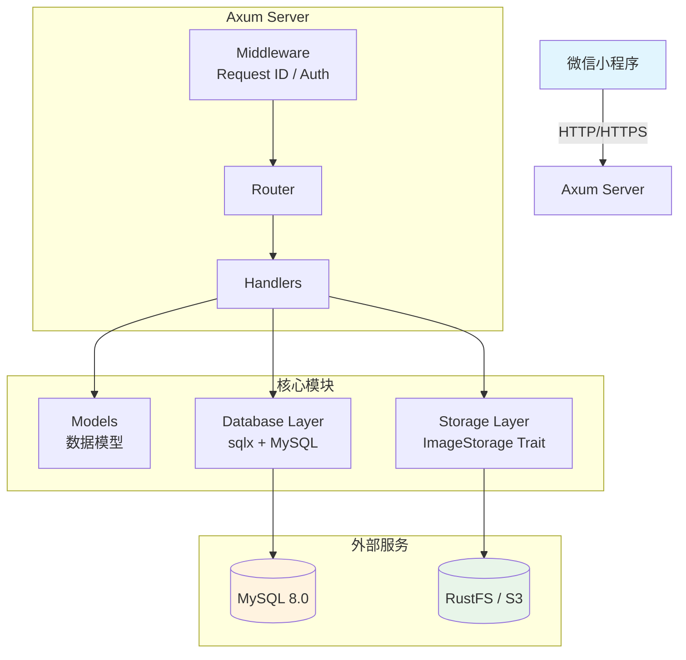
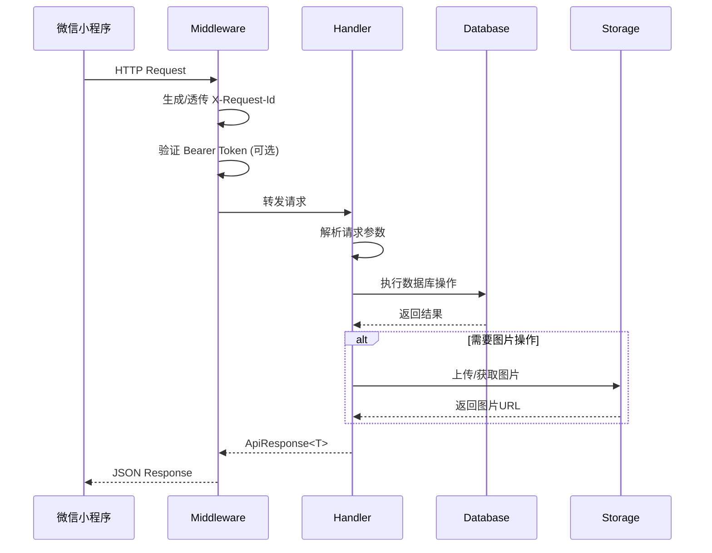

# Goodser 库存管理系统 Rust 后端实验报告

## 一、项目功能介绍

### 1.1 项目概述

Goodser 是一个库存管理系统，本项目为该系统的 Rust 后端服务，为微信小程序提供 REST API 接口。系统支持多仓库管理、商品出入库、库存盘点、图片存储等功能。

### 1.2 系统架构图



### 1.3 请求处理流程



### 1.4 核心功能模块

| 模块 | 功能描述 |
|------|---------|
| **库存目录管理** | 创建、更新、删除库存目录，查看库存统计信息 |
| **商品管理** | 商品的增删改查、序号分配、搜索功能 |
| **入库管理** | 单独入库、批量入库、搜索导入入库，记录入库日志 |
| **出库管理** | 创建出库单、确认出库、取消出库、预留转出库 |
| **标签管理** | 标签的增删改查，商品标签关联 |
| **状态码管理** | 状态编码的增删改查，支持系统预设和自定义状态 |
| **白名单管理** | 基于微信 openid 的访问控制 |
| **图片存储** | 集成 RustFS (S3兼容) 对象存储，支持图片上传、预签名URL |

---

## 二、作业要求要点与项目对应

### 2.1 模块化设计

项目采用清晰的模块化结构，包含 7 个主要模块：

```
backend/src/
├── main.rs         # 入口：路由注册、Server 启动
├── config.rs       # 环境配置加载
├── error.rs        # 错误定义与 HTTP 响应转换
├── models/         # 数据模型 struct/enum
├── db/             # MySQL 数据访问层
├── handlers/       # API handler 函数
├── middleware/      # 中间件（鉴权、请求追踪）
└── storage/        # RustFS (S3) 图片存储
```

**核心代码 - 模块声明** (`src/main.rs:1-8`)：

```rust
mod config;
mod db;
mod error;
mod handlers;
mod middleware;
mod models;
mod storage;
```

### 2.2 错误处理

项目使用 `thiserror` 定义自定义错误类型，通过 `?` 操作符传播错误，避免大量使用 `unwrap`。

**核心代码 - 错误定义** (`src/error.rs:6-28`)：

```rust
#[derive(Debug, thiserror::Error)]
pub enum AppError {
    #[error("Not found: {0}")]
    NotFound(String),

    #[error("Bad request: {0}")]
    BadRequest(String),

    #[error("Conflict: {0}")]
    Conflict(String),

    #[error("Unauthorized")]
    Unauthorized,

    #[error("Database error: {0}")]
    Database(#[from] sqlx::Error),

    #[error("Storage error: {0}")]
    Storage(String),

    #[error("Internal error: {0}")]
    Internal(String),
}
```

**错误响应转换** (`src/error.rs:36-56`)：

```rust
impl IntoResponse for AppError {
    fn into_response(self) -> Response {
        let (status, code, message) = match &self {
            AppError::NotFound(msg) => (StatusCode::NOT_FOUND, 40400, msg.clone()),
            AppError::BadRequest(msg) => (StatusCode::BAD_REQUEST, 40001, msg.clone()),
            AppError::Conflict(msg) => (StatusCode::CONFLICT, 40900, msg.clone()),
            AppError::Unauthorized => (StatusCode::UNAUTHORIZED, 40100, "Unauthorized".into()),
            AppError::Database(e) => {
                tracing::error!("Database error: {e}");
                (StatusCode::INTERNAL_SERVER_ERROR, 50000, "Internal server error".into())
            }
            // ...
        };
        let body = ErrorResponse { code, message };
        (status, Json(body)).into_response()
    }
}
```

### 2.3 Rust 核心特性

#### 2.3.1 所有权/借用

函数签名全部使用引用，避免不必要的 clone：

```rust
// src/db/mysql.rs
pub async fn get_inventory(&self, id: &str) -> AppResult<Inventory> {
    sqlx::query_as::<_, Inventory>("SELECT * FROM inventories WHERE id = ?")
        .bind(id)
        .fetch_optional(&self.pool)
        .await?
        .ok_or_else(|| AppError::NotFound(format!("Inventory {id} not found")))
}
```

#### 2.3.2 struct/enum

项目定义了丰富的数据模型枚举和结构体：

```rust
// src/models/inventory.rs
#[derive(Debug, Clone, Serialize, Deserialize, sqlx::FromRow)]
pub struct Inventory {
    pub id: String,
    pub name: String,
    pub owner_openid: String,
    pub sort_order: i32,
    pub created_at: NaiveDateTime,
    pub updated_at: NaiveDateTime,
}
```

#### 2.3.3 trait

使用 trait 抽象对象存储接口，便于测试和扩展：

```rust
// src/storage/mod.rs
#[async_trait]
pub trait ImageStorage: Send + Sync {
    async fn upload(&self, key: &str, data: &[u8], content_type: &str) -> AppResult<String>;
    async fn delete(&self, key: &str) -> AppResult<()>;
    async fn url(&self, key: &str) -> AppResult<String>;
    async fn exists(&self, _key: &str) -> AppResult<bool> { Ok(false) }
    async fn presign_upload(&self, key: &str, content_type: &str, expires_in_secs: u64) -> AppResult<String>;
    async fn presign_download(&self, key: &str, expires_in_secs: u64) -> AppResult<String>;
}
```

#### 2.3.4 泛型

使用泛型定义统一的 API 响应包装器：

```rust
// src/models/mod.rs
#[derive(Serialize)]
pub struct ApiListResponse<T: Serialize> {
    pub items: Vec<T>,
    pub total: i64,
}
```

#### 2.3.5 生命周期

在中间件中使用生命周期标注：

```rust
// src/middleware/mod.rs
pub async fn auth_middleware(
    State(api_key): State<String>,
    req: Request,
    next: Next,
) -> Result<Response, AppError> {
    // ...
}
```

### 2.4 异步编程

项目使用 tokio + Axum 全异步架构，sqlx 异步数据库操作：

```rust
// src/main.rs
#[tokio::main]
async fn main() {
    // ...
    let repo = MysqlRepository::new(&cfg.database_url)
        .await
        .expect("Failed to connect to database");
    // ...
}
```

### 2.5 测试

项目包含单元测试和集成测试：

**配置测试** (`src/config.rs:82-92`)：

```rust
#[test]
fn test_default_host() {
    let vars = mock_env(&[
        ("DATABASE_URL", "mysql://test@localhost/test"),
        ("RUSTFS_ACCESS_KEY", "test-key"),
        ("RUSTFS_SECRET_KEY", "test-secret"),
    ]);
    let cfg = AppConfig::from_reader(vars);
    assert_eq!(cfg.host, "0.0.0.0");
    assert_eq!(cfg.port, 8080);
}
```

**中间件测试** (`src/middleware/mod.rs:78-93`)：

```rust
#[tokio::test]
async fn test_auth_middleware_valid_key() {
    let api_key = "test-key".to_string();
    let app = Router::new()
        .route("/api/test", get(|| async { "ok" }))
        .layer(from_fn_with_state(api_key.clone(), auth_middleware))
        .with_state(());

    let req = Request::builder()
        .uri("/api/test")
        .header(AUTHORIZATION, "Bearer test-key")
        .body(Body::empty())
        .unwrap();

    let resp = app.oneshot(req).await.unwrap();
    assert_eq!(resp.status(), StatusCode::OK);
}
```

---

## 三、核心代码分析

### 3.1 配置管理与依赖注入

**问题描述**：

`AppConfig::from_env()` 通过 `std::env::var()` 读取系统环境变量构造配置对象。原测试代码使用 `env::set_var()` 修改全局环境变量，导致：
- 非线程安全（`std::env::set_var` 非线程安全）
- 容器环境变量污染
- 测试并行度降低

**解决方案**：依赖注入（Dependency Injection）

```rust
// src/config.rs
impl AppConfig {
    pub fn from_env() -> Self {
        Self::from_reader(env::var)
    }

    fn from_reader<F>(get: F) -> Self
    where
        F: Fn(&str) -> Result<String, env::VarError>,
    {
        Self {
            host: get("APP_HOST").unwrap_or_else(|_| "0.0.0.0".into()),
            port: get("APP_PORT")
                .ok()
                .and_then(|v| v.parse().ok())
                .unwrap_or(8080),
            database_url: get("DATABASE_URL")
                .expect("DATABASE_URL must be set"),
            // ...
        }
    }
}
```

**测试使用 mock 闭包**：

```rust
fn mock_env<'a>(pairs: &'a [(&'a str, &'a str)]) -> impl Fn(&str) -> Result<String, env::VarError> + 'a {
    let map: std::collections::HashMap<String, String> = pairs
        .iter()
        .map(|(k, v)| (k.to_string(), v.to_string()))
        .collect();
    move |key| match map.get(key) {
        Some(v) => Ok(v.clone()),
        None => Err(env::VarError::NotPresent),
    }
}
```

### 3.2 中间件实现

#### 3.2.1 API Key 认证中间件

```rust
// src/middleware/mod.rs
pub async fn auth_middleware(
    State(api_key): State<String>,
    req: Request,
    next: Next,
) -> Result<Response, AppError> {
    let header = req
        .headers()
        .get(AUTHORIZATION)
        .and_then(|v| v.to_str().ok())
        .unwrap_or("");

    let token = header.strip_prefix("Bearer ").unwrap_or("");

    if token.is_empty() {
        return Err(AppError::Unauthorized);
    }

    if token != api_key {
        let path = req.uri().path();
        tracing::warn!("Auth failed for {path}: invalid API key (len={})", token.len());
        return Err(AppError::Unauthorized);
    }

    Ok(next.run(req).await)
}
```

#### 3.2.2 请求追踪中间件

```rust
pub async fn request_id_middleware(
    req: Request,
    next: Next,
) -> Response {
    let request_id = req
        .headers()
        .get("X-Request-Id")
        .and_then(|v| v.to_str().ok())
        .map(|s| s.to_string())
        .unwrap_or_else(|| {
            uuid::Uuid::new_v4().to_string()
        });

    let path = req.uri().path().to_string();
    let method = req.method().to_string();

    let span = tracing::info_span!(
        "request",
        request_id = %request_id,
        method = %method,
        path = %path,
    );
    let _guard = span.enter();

    let response = next.run(req).await;

    let status = response.status();
    tracing::info!(status = %status, "response");

    response
}
```

### 3.3 数据库访问层

使用 sqlx 的 Repository 模式，封装所有数据库操作：

```rust
// src/db/mysql.rs
#[derive(Clone)]
pub struct MysqlRepository {
    pool: Pool<MySql>,
}

impl MysqlRepository {
    pub async fn new(database_url: &str) -> AppResult<Self> {
        let pool = MySqlPoolOptions::new()
            .max_connections(10)
            .connect(database_url)
            .await
            .map_err(|e| {
                tracing::error!("Failed to connect to MySQL: {e}");
                AppError::Internal(format!("Database connection failed: {e}"))
            })?;
        let repo = Self { pool };
        repo.run_migrations().await?;
        Ok(repo)
    }

    // 序号分配逻辑（回收再利用）
    pub async fn allocate_seq_number(
        &self,
        inventory_id: &str,
        main_zone: &str,
        sub_zone: &str,
    ) -> AppResult<i32> {
        // 优先使用回收的序号
        let recycled: Option<(i32, String)> = sqlx::query_as(
            "SELECT seq_number, id FROM recycled_seq_numbers \
             WHERE inventory_id = ? AND main_zone = ? AND sub_zone = ? \
             ORDER BY seq_number ASC LIMIT 1",
        )
        .bind(inventory_id)
        .bind(main_zone)
        .bind(sub_zone)
        .fetch_optional(&self.pool)
        .await?;

        if let Some((seq, recycled_id)) = recycled {
            sqlx::query("DELETE FROM recycled_seq_numbers WHERE id = ?")
                .bind(&recycled_id)
                .execute(&self.pool)
                .await?;
            return Ok(seq);
        }

        // 否则分配新序号
        // ...
    }
}
```

### 3.4 对象存储抽象

使用 trait 抽象 S3 存储接口，便于扩展和测试：

```rust
// src/storage/mod.rs
#[async_trait]
pub trait ImageStorage: Send + Sync {
    async fn upload(&self, key: &str, data: &[u8], content_type: &str) -> AppResult<String>;
    async fn delete(&self, key: &str) -> AppResult<()>;
    async fn url(&self, key: &str) -> AppResult<String>;
    async fn presign_upload(&self, key: &str, content_type: &str, expires_in_secs: u64) -> AppResult<String>;
    async fn presign_download(&self, key: &str, expires_in_secs: u64) -> AppResult<String>;
}

// src/storage/rustfs.rs
pub struct RustFsStorage {
    client: Client,
    bucket: String,
    public_url: Option<String>,
    endpoint: String,
}

#[async_trait]
impl ImageStorage for RustFsStorage {
    async fn upload(&self, key: &str, data: &[u8], content_type: &str) -> AppResult<String> {
        let body = ByteStream::from(data.to_vec());
        self.client
            .put_object()
            .bucket(&self.bucket)
            .key(key)
            .body(body)
            .content_type(content_type)
            .send()
            .await
            .map_err(|e| {
                AppError::Storage(format!("S3 upload failed for {key}: {e}"))
            })?;
        self.url(key).await
    }
    // ...
}
```

---

## 四、遇到的问题与解决方案

### 4.1 配置测试的线程安全问题

**问题**：`std::env::set_var/remove_var` 非线程安全，多测试并行执行时产生竞态。

**解决方案**：采用依赖注入模式，将 `from_env()` 拆分为两层：
- `from_env()` 从真实环境变量读取
- `from_reader()` 接受任意 key-value 读取器

**效果对比**：

| 维度 | Mutex 串行化 | 依赖注入 |
|------|-------------|---------|
| 线程安全 | ❌ Mutex 只是掩盖竞态 | ✅ 无共享可变状态 |
| 并行度 | ❌ 所有 config 测试串行 | ✅ 可完全并行 |
| 测试隔离 | ❌ 仍需 `clear_all_vars` | ✅ 每个测试独立 mock |
| 代码侵入 | ❌ 测试代码修改 env | ✅ 不触碰全局 env |

### 4.2 数据库迁移管理

**问题**：需要在应用启动时自动执行数据库表结构创建和初始数据导入。

**解决方案**：在 `MysqlRepository` 初始化时执行迁移脚本：

```rust
const MIGRATIONS: &[&str] = &[
    "CREATE TABLE IF NOT EXISTS inventories (...)",
    "CREATE TABLE IF NOT EXISTS products (...)",
    // ...
];

const SEED_DATA: &[&str] = &[
    "INSERT IGNORE INTO status_codes ...",
    "INSERT IGNORE INTO tags ...",
];

impl MysqlRepository {
    async fn run_migrations(&self) -> AppResult<()> {
        for sql in MIGRATIONS {
            sqlx::query(sql).execute(&self.pool).await.map_err(|e| {
                tracing::error!("Migration failed: {e}");
                AppError::Internal(format!("Migration failed: {e}"))
            })?;
        }
        // 导入初始数据
        for sql in SEED_DATA {
            sqlx::query(sql).execute(&self.pool).await?;
        }
        Ok(())
    }
}
```

### 4.3 序号回收再利用

**问题**：商品删除后，其序号需要被回收并在新建商品时重新分配。

**解决方案**：
1. 创建 `recycled_seq_numbers` 表存储回收的序号
2. 创建 `seq_counters` 表跟踪各区域的最大序号
3. 分配序号时优先使用回收的序号，否则分配新序号

```rust
pub async fn allocate_seq_number(...) -> AppResult<i32> {
    // 1. 优先使用回收的序号
    let recycled = sqlx::query_as(
        "SELECT seq_number, id FROM recycled_seq_numbers ..."
    ).fetch_optional(&self.pool).await?;

    if let Some((seq, recycled_id)) = recycled {
        // 删除回收记录，返回该序号
        sqlx::query("DELETE FROM recycled_seq_numbers WHERE id = ?")
            .bind(&recycled_id).execute(&self.pool).await?;
        return Ok(seq);
    }

    // 2. 否则分配新序号（current_max + 1）
    // ...
}
```

### 4.4 Docker 环境下的开发体验

**问题**：容器内预设了大量环境变量，影响测试的默认值验证。

**解决方案**：
1. 使用 `.env` 文件管理开发环境变量
2. 提供 `.env.example` 作为模板
3. 配置 `docker-compose.yml` 挂载源码目录，支持 `cargo-watch` 热重载

```yaml
# docker-compose.yml
services:
  backend:
    build:
      context: ./backend
      target: development
    volumes:
      - ./backend/src:/app/src
    # ...
```

---

## 五、Rust 特性使用总结

| 特性 | 体现位置 | 说明 |
|------|---------|------|
| **所有权/借用** | 函数签名 | 全部使用引用 (`&str`, `&Request`)，避免不必要 clone |
| **struct/enum** | models/ | `OrderType`, `OrderStatus`, `InboundType` 等枚举 + 9 个业务 struct |
| **trait** | storage/mod.rs | `ImageStorage` trait 抽象对象存储 |
| **泛型** | models/mod.rs | `ApiListResponse<T>` 统一响应包装器 |
| **生命周期** | middleware/ | `&'static str` 在 middleware 中标注 API key 生命周期 |
| **错误处理** | error.rs | 自定义 `AppError` (thiserror)，`?` 操作符传播 |
| **async/await** | 全局 | tokio + Axum 全异步，sqlx 异步数据库 |
| **模块化** | 项目结构 | 7 个模块清晰分离关注点 |

---

## 六、工程规范

### 6.1 代码格式化

```bash
cargo fmt
```

### 6.2 代码检查

```bash
cargo clippy
```

### 6.3 测试

```bash
cargo test
```

---

## 七、项目文档

### 7.1 启动方式

```bash
# 克隆项目
cd goodser-backend

# 复制环境变量
cp .env.example .env
# 编辑 .env 修改 API_KEY 等配置

# 启动所有服务
docker compose up -d

# 查看日志
docker compose logs -f backend
```

### 7.2 依赖说明

- **Web 框架**: Axum 0.7
- **数据库**: MySQL 8.0 (sqlx)
- **对象存储**: RustFS (S3-compatible)
- **运行环境**: Docker

---

## 八、创新性与实用性

1. **序号回收机制**：实现了商品序号的回收再利用，避免序号浪费
2. **依赖注入测试**：采用函数式依赖注入，解决环境变量测试的线程安全问题
3. **Trait 抽象存储**：使用 trait 抽象 S3 存储接口，便于扩展到其他存储后端
4. **请求追踪**：实现 X-Request-Id 中间件，支持分布式请求追踪
5. **Docker 开发体验**：配置热重载，提升开发效率

---

## 九、总结

本项目综合运用了 Rust 语言的核心特性，包括所有权系统、trait 抽象、错误处理、异步编程等，实现了一个功能完整的库存管理系统后端。通过依赖注入解决了配置测试的线程安全问题，通过 trait 抽象实现了存储接口的可扩展性，体现了良好的工程实践。
